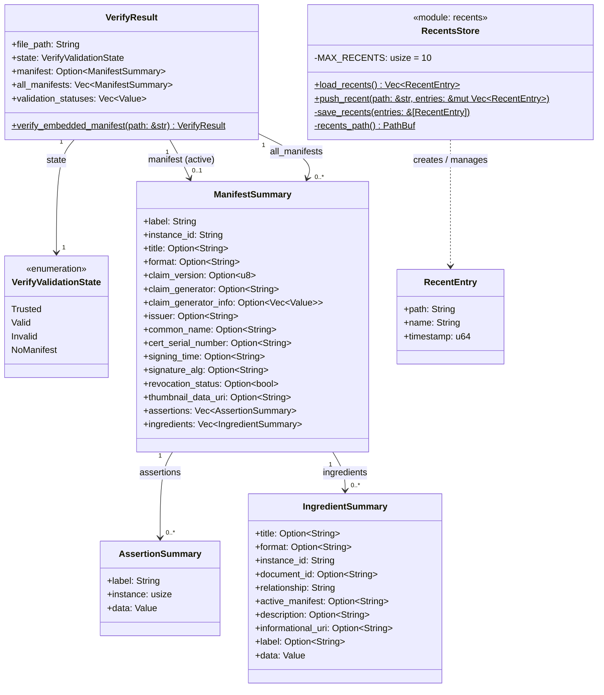

# Model Layer — Class Diagram

## Notes

| Type | Module | Role |
|---|---|---|
| `VerifyValidationState` | `manifest` | Enum mapping the c2pa `ValidationState` to a serialisable form understood by the UI. |
| `AssertionSummary` | `manifest` | Flattened view of one assertion inside a manifest (label, 1-based instance index, raw JSON payload). |
| `IngredientSummary` | `manifest` | Flattened view of one ingredient assertion, including the JUMBF assertion `label` used for assertion→ingredient navigation. |
| `ManifestSummary` | `manifest` | Complete summary of one C2PA manifest as parsed against spec v2.4: claim metadata, signature details, assertions, and ingredients. |
| `VerifyResult` | `manifest` | Top-level output of `verify_embedded_manifest`. Carries the active manifest, all other manifests in the store, the validation state, and raw validation statuses. |
| `RecentEntry` | `recents` | One entry in the persisted recently-opened-files list. |
| `RecentsStore` | `recents` | Module-level functions that load, mutate, and persist the recents list to `~/.c2pa-tool/recents.json`. Represented as a class for diagram clarity; there is no struct. |
